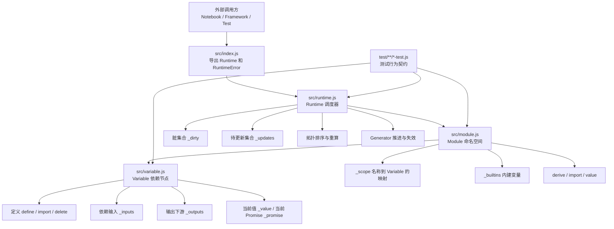
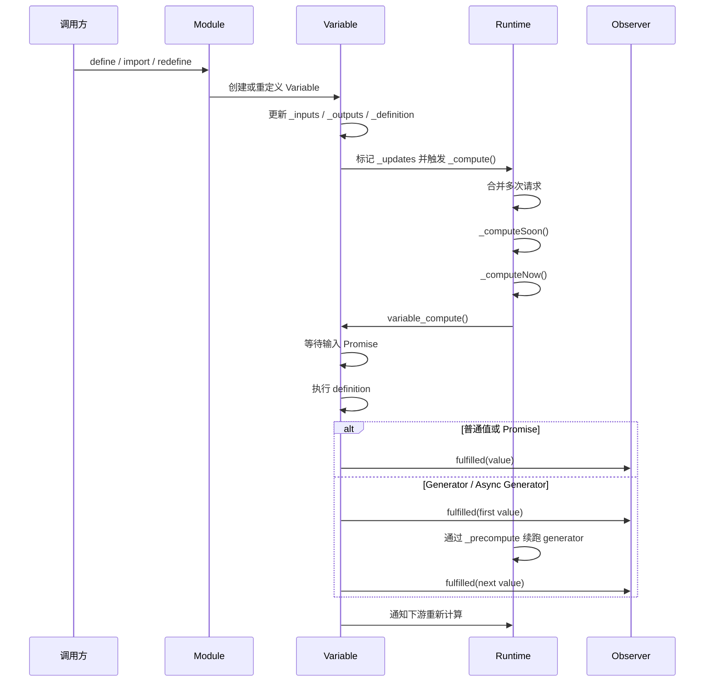
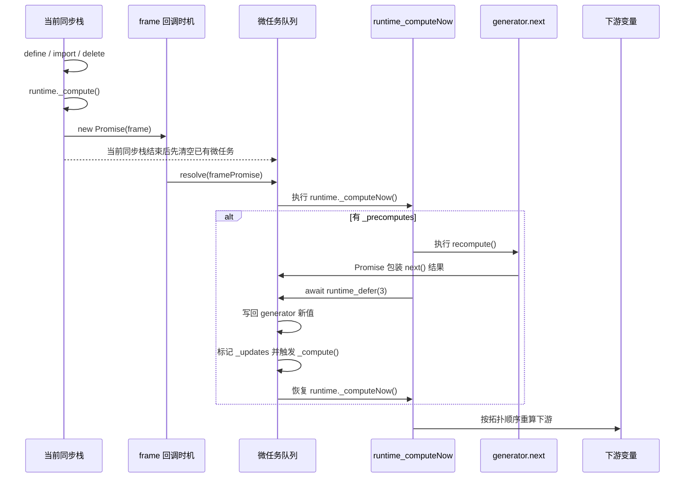

# Observable Runtime 架构说明

## 1. 这个工程的目的是什么

这个工程是 Observable 的响应式运行时。它不负责解析源码，也不负责渲染 UI；它负责把“变量之间的依赖关系”组织成一张有向图，并在输入变化时按正确顺序重算受影响的变量。

可以把它看成一个更通用的“响应式单元执行引擎”：

- 在 Observable Notebook 里，每个 cell 都可以映射成一个 Variable。
- 多个 Variable 组成一个 Module，也就是一个命名空间。
- 一个 Runtime 负责调度所有 Module 和 Variable 的计算、失效、清理与重算。

工程的官方定位也写在 README：它实现了 Observable Framework 和 Observable notebooks 的 reactivity。

## 2. 这个工程解决的核心问题

如果只用普通 JavaScript 函数，很难同时解决下面这些问题：

- 一个变量依赖多个上游时，如何只在必要时重算。
- 一个变量被重新定义后，如何把旧依赖和新依赖正确切换。
- 两个变量重名时，如何让引用先进入错误态，再在冲突解除后自动恢复。
- 变量返回 Promise、Generator、Async Generator 时，如何统一成同一种运行模型。
- 一个变量没人观察时，如何停止它的计算，避免无意义工作和资源泄漏。
- 有环依赖时，如何检测并向整条链路传播错误。

这个仓库就是为了解决这些问题而写的，而且实现方式很集中，核心逻辑基本都在 [src/runtime.js](../src/runtime.js)、[src/module.js](../src/module.js)、[src/variable.js](../src/variable.js) 三个文件里。

## 3. 总体结构图



## 4. 核心抽象各自负责什么

### 4.1 Runtime：全局调度器

对应源码：[src/runtime.js](../src/runtime.js)

Runtime 是整个系统的“大脑”，主要职责是：

- 保存所有模块与活动变量。
- 接收变量变更带来的脏标记。
- 把多次变更合并到一次调度里。
- 计算哪些变量当前可达、哪些应当停止。
- 以拓扑顺序重算变量。
- 驱动 generator 类变量逐步产出新值。
- 在 dispose 时统一失效并终止资源。

源码中的关键成员：

- `_dirty`：被标记为脏的变量集合。
- `_updates`：本轮需要更新的变量集合。
- `_precomputes`：下一轮正式重算前要先执行的回调，主要给 generator 续跑使用。
- `_computing`：当前是否已经有一轮计算在排队或执行，用于去重调度。
- `_modules`：缓存 `runtime.module(define)` 生成的模块。
- `_variables`：当前所有活动变量，用于 dispose 时统一清理。

关键方法：

- `runtime.module(...)`：创建或复用模块。
- `runtime._compute()`：调度一轮计算，但避免重复排队。
- `runtime._computeSoon()`：把本轮计算推迟到后续调度点。
- `runtime._computeNow()`：真正执行可达性分析、拓扑排序和变量计算。
- `runtime.dispose()`：失效所有变量并终止 generator。

### 4.2 Module：变量命名空间

对应源码：[src/module.js](../src/module.js)

Module 主要解决“变量名字如何解析”的问题。它不是调度器，而是一个命名空间容器。

它负责：

- 保存当前模块里的名字到变量对象的映射。
- 支持 `define`、`import`、`redefine` 这些高层 API。
- 在变量不存在时，按顺序尝试从 shadow、builtins、runtime 内建模块、全局环境解析。
- 提供 `derive`，生成一个带注入覆盖能力的派生模块。
- 提供 `value(name)`，以 Promise 形式拿到某个变量的下一个值。

关键成员：

- `_scope`：当前模块的符号表。
- `_builtins`：模块级内建变量。
- `_source`：如果这是 derive 产生的模块，指向原模块。

关键方法：

- `module.define(...)`：创建普通变量。
- `module.import(...)`：创建导入变量。
- `module.redefine(...)`：重定义已有命名变量。
- `module.derive(...)`：复制变量定义并注入覆盖项。
- `module.value(name)`：拿某个变量的下一次值。
- `module._resolve(name)`：名称解析的底层实现。

### 4.3 Variable：依赖图中的节点

对应源码：[src/variable.js](../src/variable.js)

Variable 是整个依赖图里最核心的数据结构。每个 Observable 单元、每个内建值、每个导入项，最终都要落成一个 Variable。

它负责：

- 保存自己的定义函数、输入依赖、输出依赖、当前值和版本号。
- 在 `define`/`import`/`delete` 时修改依赖图连线。
- 处理命名冲突、隐式变量和重复定义错误。
- 触发 runtime 的脏标记和更新调度。
- 通过 observer 把 pending / fulfilled / rejected 状态通知出去。

关键成员：

- `_inputs`：当前变量依赖的上游变量。
- `_outputs`：依赖当前变量的下游变量。
- `_definition`：真正的定义函数。
- `_promise`：当前值对应的 Promise 链。
- `_value`：当前已发布的值。
- `_version`：防止旧计算结果覆盖新定义。
- `_reachable`：当前是否对某个 observer 可达。
- `_observer`：外部观察者。

关键方法：

- `variable.define(...)`：定义或重定义变量。
- `variable.import(...)`：把远端变量映射为本地别名。
- `variable.delete()`：删除定义并解除命名。
- `variable_resolve(...)`：解析输入名到实际 Variable。
- `variable_defineImpl(...)`：真正执行依赖图改线、重名处理和调度触发。

## 5. 一次计算是怎么发生的

### 5.1 从 define 到重算

最常见的起点是：调用 `module.variable(...).define(...)` 或 `module.define(...)`。

执行链路如下：

1. [src/variable.js](../src/variable.js) 中的 `variable_define` 规范化参数，把输入名解析成真实 Variable。
2. `variable_defineImpl` 把旧输入解绑，把新输入绑定到当前变量。
3. 如果变量名变化，还会更新 [src/module.js](../src/module.js) 里的 `_scope`，并修复其他变量对该名字的引用。
4. 变量被加入 Runtime 的 `_updates`，同时调用 `runtime._compute()`。
5. [src/runtime.js](../src/runtime.js) 发现当前没有正在排队的计算，就创建一轮新的调度。

### 5.2 Runtime 如何决定计算顺序

真正的计算发生在 [src/runtime.js](../src/runtime.js) 的 `runtime_computeNow`。

这个函数会做四件事：

1. 先处理 `_precomputes`，也就是 generator 下一步拉取前的准备回调。
2. 从 `_dirty` 出发，重新计算“哪些变量对 observer 可达”。
3. 从 `_updates` 出发，收集本轮需要更新的可达变量，并计算它们的入度。
4. 按拓扑顺序执行 `variable_compute`；如果存在环，则把相关变量变成 `RuntimeError("circular definition")`。

这就是整个运行时最重要的行为：

- 不直接深度递归执行依赖。
- 不按定义顺序盲算。
- 而是先构造更新子图，再按拓扑顺序统一推进。

### 5.3 Variable 如何求值

单个变量的求值逻辑在 [src/runtime.js](../src/runtime.js) 的 `variable_compute`。

它的 Promise 链结构可以概括为：

1. 等待上一次 `_promise` 完成，避免同一个变量的多次求值并发写入。
2. 读取所有输入变量的值。
3. 调用当前定义函数。
4. 如果结果是普通值，直接发布。
5. 如果结果是 Promise，等待 Promise resolve 后发布。
6. 如果结果是 Generator / Async Generator，交给 `variable_generate` 持续推进。

这个设计的好处是，不管定义函数返回的是同步值、异步值还是流式值，外部都能用统一的 `_promise` 和 observer 接口来消费。

## 6. Generator、Promise 与失效是怎么统一的

对应源码主入口：[src/runtime.js](../src/runtime.js)

### 6.1 Promise

如果一个变量返回 Promise，运行时会等待 Promise resolve，再把结果写入 `_value`，随后通知 observer，并继续触发下游变量更新。

这使得依赖该变量的其他变量无需关心它是同步还是异步来源。

### 6.2 Generator / Async Generator

如果定义结果满足 [src/generatorish.js](../src/generatorish.js) 的判断条件，也就是同时具备 `next` 和 `return`，运行时会把它当作可持续产出值的源。

对应实现是 [src/runtime.js](../src/runtime.js) 的 `variable_generate`。

它负责：

- 拉取第一个值并发布。
- 在后续调度点继续调用 `generator.next(...)`。
- 每次 yield 新值后，更新当前变量并触发下游重算。
- 当变量失效或 runtime dispose 时，调用 `generator.return()` 做资源清理。

这正是 Observable 支持“随时间变化的 cell”的关键。

### 6.3 invalidation 和 visibility

在 [src/module.js](../src/module.js) 里，`invalidation` 和 `visibility` 被作为特殊内建符号暴露。

它们在 [src/runtime.js](../src/runtime.js) 的 `variable_compute` 中被替换成真正的运行时对象：

- `invalidation`：一个 Promise，在变量失效时 resolve。
- `visibility`：一个函数，依赖 IntersectionObserver 来等待节点重新可见。

这意味着用户定义函数只要声明这些输入名，就能接入运行时的生命周期控制。

## 7. 名称解析和重名冲突是怎么处理的

对应源码：[src/module.js](../src/module.js)、[src/variable.js](../src/variable.js)

### 7.1 未定义引用

当某个输入名还没有被定义时，`module._resolve(name)` 会先创建一个 `TYPE_IMPLICIT` 变量占位。

这样做的好处是：

- 下游变量可以先建立依赖关系。
- 等真正的定义补上时，这些依赖关系可以自动接回去。
- 如果最终还是没定义，才在求值时抛出“xxx is not defined”。

### 7.2 重名变量

如果同一个模块里两个变量同时定义了相同的名字，运行时不会随便覆盖其中一个，而是显式创建一个 `TYPE_DUPLICATE` 错误节点。

这样所有依赖这个名字的变量都会进入错误态，直到冲突解除。

相关逻辑集中在 [src/variable.js](../src/variable.js) 的 `variable_defineImpl`。

## 8. derive / import 机制在做什么

对应源码：[src/module.js](../src/module.js)

这是本仓库非常值得关注的一块，因为它体现了 Observable “模块组合”的设计。

- `import`：把另一个模块里的变量接入当前模块，本质是创建一个定义函数为 `identity` 的别名变量。
- `derive`：复制当前模块的定义，并允许把某些名字改为从另一个模块注入。

`derive` 的关键意义在于：

- 原模块不必被改写。
- 派生模块可以用新的依赖覆盖旧定义。
- 多级派生时，运行时还会递归复制导入链，避免注入只改到表面而没改到深层依赖。

这部分逻辑主要在 `module_derive`，也是测试里覆盖较多的高级能力之一。

## 9. 可达性与懒计算为什么重要

对应源码：[src/runtime.js](../src/runtime.js)

这个运行时并不是“定义了就一定一直跑”。它会计算变量是否 reachable。

判断逻辑大意是：

- 有 observer 的变量，直接可达。
- 没有 observer，但它的某个下游最终连到有 observer 的变量，也算可达。
- 完全没人需要的变量，可以不算，或者在失去可达性后终止 generator。

这样能避免两类问题：

- 无意义重算，浪费 CPU。
- 无人消费的 generator 继续运行，造成资源泄漏。

相关实现：`variable_reachable`、`runtime_computeNow`、`runtime.dispose()`。

## 10. 文件级源码地图

| 文件 | 主要作用 | 你应该关注什么 |
| --- | --- | --- |
| [src/index.js](../src/index.js) | 公开 API 入口 | 只导出 `Runtime` 与 `RuntimeError` |
| [src/runtime.js](../src/runtime.js) | 调度、拓扑排序、generator 推进、dispose | 整个工程最核心的执行引擎 |
| [src/module.js](../src/module.js) | 模块、名字解析、derive、import、value | 命名空间和模块组合能力 |
| [src/variable.js](../src/variable.js) | 变量定义、依赖连接、命名冲突、observer | 依赖图节点和图改线逻辑 |
| [src/generatorish.js](../src/generatorish.js) | 判断返回值是否可按 generator 处理 | generator 入口判断 |
| [src/errors.js](../src/errors.js) | 统一运行时错误类型 | 对外暴露的 `RuntimeError` |
| [src/constant.js](../src/constant.js) | 把常量包装成函数 | 统一 define 处理入口 |
| [src/identity.js](../src/identity.js) | 导入变量的透传函数 | import 本质上依赖它 |
| [src/rethrow.js](../src/rethrow.js) | 把全局解析错误延后到求值时抛出 | 名称解析失败路径 |
| [src/noop.js](../src/noop.js) | 空操作函数 | 删除变量与默认失效处理 |
| [src/array.js](../src/array.js) | 取出 Array 原型方法引用 | 轻量工具函数 |

## 11. 测试文件各自在验证什么

测试目录基本可以当成这个运行时的行为规格说明。

| 测试文件 | 关注点 |
| --- | --- |
| [test/variable/define-test.js](../test/variable/define-test.js) | define 的各种签名、重名、缺失输入、Promise、Generator、可达性与循环依赖 |
| [test/variable/import-test.js](../test/variable/import-test.js) | import 语义是否正确 |
| [test/variable/delete-test.js](../test/variable/delete-test.js) | 删除变量后的恢复与失效行为 |
| [test/variable/derive-test.js](../test/variable/derive-test.js) | 派生模块与注入覆盖行为 |
| [test/variable/shadow-test.js](../test/variable/shadow-test.js) | shadow 解析优先级 |
| [test/module/value-test.js](../test/module/value-test.js) | `module.value(name)` 的异步取值契约 |
| [test/module/redefine-test.js](../test/module/redefine-test.js) | redefine 的边界条件 |
| [test/module/builtin-test.js](../test/module/builtin-test.js) | module builtin 行为 |
| [test/runtime/builtins-test.js](../test/runtime/builtins-test.js) | runtime builtins 支持 Promise / Function / Generator |
| [test/runtime/dispose-test.js](../test/runtime/dispose-test.js) | dispose 是否正确失效变量并终止 generator |

## 12. 一张执行时序图



## 13. 如果只看三个文件，应该先看哪里

如果你想最快理解这个工程，阅读顺序建议是：

1. [src/variable.js](../src/variable.js)：先理解变量节点怎么建图、改图、处理重名。
2. [src/runtime.js](../src/runtime.js)：再看运行时如何把这张图按顺序算出来。
3. [src/module.js](../src/module.js)：最后看命名空间、导入和派生模块如何把图拼起来。

如果你想验证理解是否正确，优先看：

1. [test/variable/define-test.js](../test/variable/define-test.js)
2. [test/module/value-test.js](../test/module/value-test.js)
3. [test/runtime/dispose-test.js](../test/runtime/dispose-test.js)

## 14. 一句话总结

这个仓库本质上是在实现一个“支持依赖解析、懒计算、异步值、生成器值、生命周期失效和模块组合”的响应式执行内核；其中 [src/variable.js](../src/variable.js) 管图节点，[src/module.js](../src/module.js) 管名字和组合，[src/runtime.js](../src/runtime.js) 管调度和执行。

## 15. runtime.js 里的宏任务、微任务与 frame 执行顺序

这一章专门解释 [src/runtime.js](../src/runtime.js) 里最容易看混的地方：`frame`、`runtime._computeSoon()`、`runtime_defer(3)`、`variable_compute()`、`variable_generate()` 之间到底谁先谁后。

### 15.1 先把术语摆正

在本仓库里，代码注释和实现真正依赖的是“调度边界”，不是浏览器事件循环术语的教科书分类。

- 同步执行：当前调用栈里的代码，立刻执行，不会让出控制权。
- 微任务：`Promise.then`、`await` 续体这一类，会在当前同步栈结束后、进入下一轮任务前执行。
- 后续任务：这里主要指 `setImmediate` 或 `setTimeout(0)` 触发的回调。
- `requestAnimationFrame`：它不是严格意义上的宏任务；它是浏览器在下次绘制前给的回调时机。

因此，这个文件里的 `frame` 更准确的意思是：

- 在浏览器里，优先把整轮重算放到“下一次绘制前”。
- 在没有 `requestAnimationFrame` 的环境里，退化成“下一次任务”。

对应实现就在 [src/runtime.js#L12](../src/runtime.js#L12)。

### 15.2 第一层边界：为什么 `_compute()` 不会立刻重算

当 [src/variable.js](../src/variable.js) 里的 `define`、`import`、`delete` 改变了变量关系后，最终会调用 `runtime._compute()`。

`runtime._compute()` 本身不会马上跑拓扑排序，它只是做一件事：

- 如果当前已经有一轮计算在排队，就复用同一个 Promise。
- 如果没有，就创建一次 `_computeSoon()`。

对应实现是 [src/runtime.js#L80](../src/runtime.js#L80) 附近的 `_compute()` 和 [src/runtime.js#L84](../src/runtime.js#L84) 的 `_computeSoon()`。

这一步的实际效果是“合并抖动”：

- 同一同步栈里连续 `define` 多次，不会触发多次独立重算。
- 它们会被并到一次后续调度中处理。

### 15.3 第二层边界：`new Promise(frame)` 到底把代码放哪了

`runtime._computeSoon()` 的实现是：

```js
return new Promise(frame).then(() => this._disposed ? undefined : this._computeNow());
```

对应源码：[src/runtime.js#L84](../src/runtime.js#L84)

这里有两层顺序：

1. `new Promise(frame)`
2. `.then(() => this._computeNow())`

执行含义不是一层，而是两层。

第一层：等待 `frame(resolve)` 里的 `resolve` 被调用。

- 如果环境支持 `requestAnimationFrame`，那么 `resolve` 会在下一次绘制前触发。
- 如果走 `setImmediate` 或 `setTimeout(0)`，那么 `resolve` 会在后续任务中触发。

第二层：`resolve` 被调用后，并不会同步执行 `_computeNow()`。

- 因为 `_computeNow()` 挂在 `.then(...)` 上。
- 所以它会进入“那一次 `frame` 回调结束之后”的微任务阶段。

也就是说，`_computeNow()` 的真实位置是：

- 先离开当前同步栈。
- 再跨过当前这批已经排队的微任务。
- 再等到 `frame` 对应的时机到来。
- 最后在那一轮里的微任务中执行 `_computeNow()`。

### 15.4 一个最小时间线

假设用户代码在同一个同步栈里连续定义两个变量：

```js
foo.define("foo", 1);
bar.define("bar", ["foo"], foo => foo + 1);
```

时间线可以近似理解为：

1. 当前同步栈里，`foo.define(...)` 修改依赖图并调用 `_compute()`。
2. 当前同步栈里，`bar.define(...)` 也调用 `_compute()`，但因为 `_computing` 已经存在，所以不会重复排队。
3. 当前同步栈结束。
4. 当前同步栈产生的普通微任务先执行完。
5. 到达 `frame` 的触发时机。
6. `frame` resolve 对应的 Promise。
7. 进入这一次 resolve 的微任务阶段。
8. 执行 `runtime._computeNow()`，统一完成本轮拓扑重算。

这个顺序解释了为什么该运行时既避免了同步重入，又能把同一批定义合并处理。

### 15.5 第三层边界：为什么 `_computeNow()` 里还要 `await runtime_defer(3)`

对应源码：[src/runtime.js#L93](../src/runtime.js#L93) 和 [src/runtime.js#L190](../src/runtime.js#L190)

`runtime_computeNow()` 一开始会先看 `_precomputes`，这通常是 generator 的“下一次继续执行”回调。

如果有 `_precomputes`，代码会：

1. 先把这些 callback 全部执行。
2. 然后 `await runtime_defer(3)`。

`runtime_defer(3)` 不是宏任务，它只是构造三层连续的 Promise 微任务链：

```js
let p = Promise.resolve();
for (let i = 0; i < depth; ++i) p = p.then(() => {});
```

它的目的不是“等 3 个 tick”这种抽象说法，而是更具体地给当前实现里已经挂上的 Promise 链让位。

这里的核心原因是：generator 的继续推进本身也是通过 Promise 链发布结果的。

- `_precompute` 回调里会触发 `generator.next(...)`。
- `generator.next(...)` 的返回值还要经过 `Promise.resolve(...).then(...)`。
- 值写回 `variable._value`、下游加入 `_updates`、再调用 `runtime._compute()`，也都挂在这条链上。

如果 `runtime_computeNow()` 在执行 `_precomputes` 后立刻继续做拓扑重算，就可能出现“generator 新值还没正式写回，下游已经开始读旧值”的竞态。

所以这里用几层微任务把当前 async 函数暂时挂起，让 generator 那条 Promise 链先跑完，再继续进入本轮拓扑计算。

### 15.6 普通变量、Promise 变量、Generator 变量的顺序差异

#### 普通同步值

对应实现：[src/runtime.js#L239](../src/runtime.js#L239)

即便定义函数同步返回普通值，`variable_compute()` 也不会在当前调用栈里把所有事情同步做完，因为整个流程已经被包进 Promise 链：

1. `variable._promise.then(init).then(define).then(generate)`
2. 值最终在 Promise 的 fulfilled 回调里写回 `_value`

所以它对外呈现的是统一的异步发布边界。

#### Promise 值

如果定义函数返回 Promise，那么只是这条 Promise 链更长了一点：

1. 先完成输入收集。
2. `definition.apply(...)` 返回 Promise。
3. 等 Promise resolve。
4. 再写入 `_value` 并通知 observer。

对 Runtime 来说，这仍然只是“当前变量的 `_promise` 何时 settle”的问题，不需要单独设计另一套调度器。

#### Generator / Async Generator 值

对应实现：[src/runtime.js#L314](../src/runtime.js#L314)

Generator 最特殊，因为它不是一次性求值，而是多次产出。

它的执行顺序可以拆成两段：

第一段，首个值：

1. `variable_compute()` 发现返回值是 generator。
2. 调用 `variable_generate(...)`。
3. `compute(onfulfilled)` 用 `Promise.resolve(generator.next(...))` 包住 `next()`。
4. 即便 `next()` 同步返回，后续 `{done, value}` 的处理仍然在微任务里。
5. 首个值返回给当前变量的 Promise 链，发布为本次计算结果。
6. 同时注册 `runtime._precompute(recompute)`，为下一次拉取做准备。

第二段，后续值：

1. 下一个 `frame` 周期开始时，`runtime_computeNow()` 先执行 `_precomputes`。
2. `recompute()` 里再次调用 `generator.next(currentValue)`。
3. 新值在微任务里进入 `postcompute(value, promise)`。
4. `postcompute` 先写 `variable._value`，再把下游变量加入 `_updates`，最后触发 `runtime._compute()`。
5. 为了避免下游过早读取旧值，当前 `runtime_computeNow()` 会先 `await runtime_defer(3)`，让这条微任务链先跑完。
6. 然后才继续本轮拓扑排序，让下游读取最新 generator 值。

一句话概括就是：

- generator 的每次 `yield` 会被拆成“本次值先落盘，再安排后续依赖重算”。
- 连续多次 `yield` 不会在一个同步栈里一口气跑到底，而是被切成一轮一轮调度。

### 15.7 为什么 `requestAnimationFrame` 和微任务会混在一起使用

这是这个文件最关键的设计点之一。

- `frame` 负责把“大批量重算”推迟到后续调度边界，避免同步重入和过度抖动。
- 微任务负责在“同一轮调度内部”精细安排先后顺序，保证值发布与依赖重算之间没有竞态。

如果只用同步调用：

- 很容易形成重入。
- 多次定义会触发重复重算。

如果只用宏观的后续任务，不用微任务细化顺序：

- generator 的值写回和下游读取之间更容易出现可见顺序问题。

所以这里是双层设计：

- 外层用 `frame` 控节奏。
- 内层用 Promise 微任务保顺序。

### 15.8 本仓库里最容易误解的三个点

1. `requestAnimationFrame` 不是“宏任务”的标准同义词。
这里的真实语义是“下一次绘制前的调度点”；代码关心的是它把计算延后，而不是它在规范分类里属于哪一类。

2. `_computeNow()` 不是在 `frame` 回调函数体里直接同步执行。
因为它挂在 `.then(...)` 上，所以它发生在 `frame` 对应 Promise resolve 之后的微任务阶段。

3. `runtime_defer(3)` 不是随意写的魔法数字。
它服务于当前这套 Promise 链实现，目的是让 generator 续跑产生的值先经过“微任务发布链”完成落盘，再让下游开始拓扑重算。

### 15.9 一张专门看事件循环的时序图



### 15.10 读代码时最值得盯住的行

- `frame` 定义：[src/runtime.js#L12](../src/runtime.js#L12)
- `_computeSoon()`：[src/runtime.js#L84](../src/runtime.js#L84)
- `_computeNow()`：[src/runtime.js#L93](../src/runtime.js#L93)
- `runtime_defer()`：[src/runtime.js#L190](../src/runtime.js#L190)
- `variable_compute()`：[src/runtime.js#L239](../src/runtime.js#L239)
- `variable_generate()`：[src/runtime.js#L314](../src/runtime.js#L314)

如果你只想抓住这个文件的执行顺序主线，可以把它压缩成一句话：先用 `frame` 把整轮重算移出当前同步栈，再用 Promise 微任务把“generator 新值发布”排到“下游依赖重算”之前。